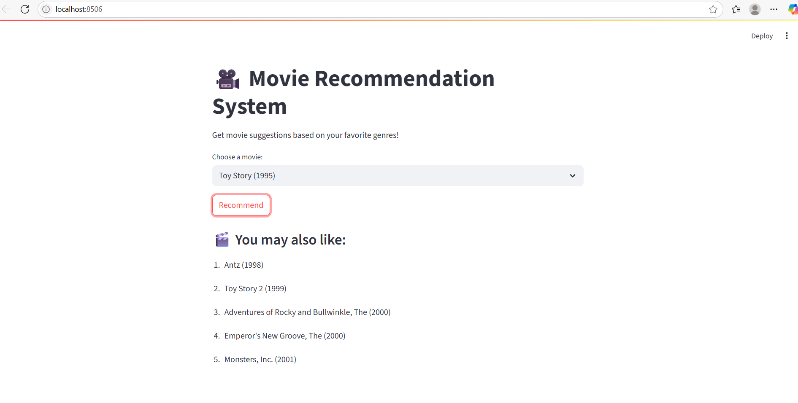

# 🎥 Movie Recommendation System

This is a web-based **Movie Recommendation App** built using **Python**, **Scikit-learn**, and **Streamlit**. It suggests similar movies based on your favorite choice by analyzing movie genres using NLP techniques.

---

## 🚀 Live Demo

🔗 [Click here to try the live app](https://movie-recommendation-system-2rnjyewttqgj49pg52xg2m.streamlit.app)

---

## 📽️ Demo Video

🎥 [Watch Demo on Google Drive](https://drive.google.com/file/d/1YaOu-d24rOWInfVAZ15NpVPvdhkgb_sb/view?usp=sharing)

---

## 📌 Features

- 🎞 Select any movie from a dropdown
- 🤖 Get 5 similar movie recommendations
- 💡 Uses TF-IDF Vectorizer and Cosine Similarity
- ⚡ Fast, responsive, and deployed on Streamlit Cloud

---

## 🧠 How It Works

1. **Data Used:** MovieLens Dataset (movies.csv, ratings.csv)
2. **Preprocessing:** Text-based features (title, genres) are transformed using **TF-IDF**
3. **Model:** Cosine similarity used to find top 5 similar movies
4. **UI:** Built using Streamlit with dropdown input and dynamic output

---

## 🛠️ Technologies Used

- **Frontend**: Streamlit
- **Backend**: Python
- **Libraries**: 
  - `pandas`
  - `scikit-learn`
  - `streamlit`

---

## 📁 Dataset Used

- **MovieLens Latest Small Dataset**  
  Source: [https://grouplens.org/datasets/movielens/](https://grouplens.org/datasets/movielens/)

Files used:
- `movies.csv`
- `ratings.csv` *(not required in current version, but part of the dataset)*

---
## 🛠️ Tech Stack

| Tool          | Purpose                           |
|---------------|-----------------------------------|
| Python        | Programming Language              |
| Pandas        | Data Analysis                     |
| Scikit-learn  | Machine Learning (TF-IDF + Cosine)|
| Streamlit     | Web App Frontend                  |
| GitHub        | Version Control                   |

---

## 📂 Project Structure

movie-recommendation-system/
│
├── ml-latest-small/ # Dataset folder
│ ├── movies.csv
│ ├── ratings.csv
│
├── movie_recommender.py # Main Streamlit app
├── requirements.txt # Python dependencies
├── README.md # Project documentation
└── screenshots/ # UI screenshots (optional)

---

## 🚀 How to Run Locally

1. **Install dependencies**:

pip install -r requirements.txt

2. **Run the Streamlit app**:

streamlit run movie_recommender.py

---

## 📸 Screenshot

### 👨‍💻 Developed By
Sai Tharun M
🎓 B.Tech in Computer Science & Engineering (2023–2027)
📍 Presidency University, Bengaluru
🔗 LinkedIn
💻 GitHub
🌐 Portfolio

### 📄 License
This project is open-source and available under the MIT License.
